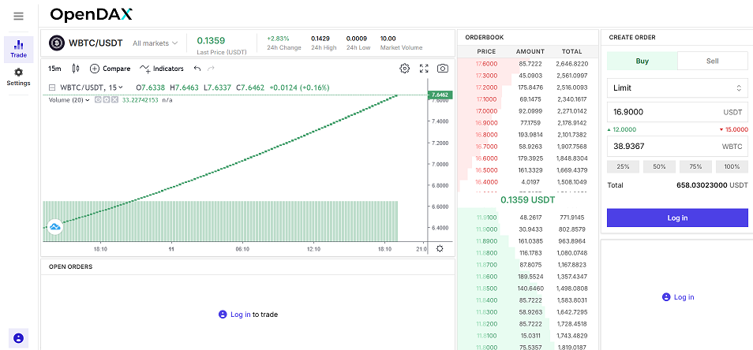

# my_opendax_trading_app

white-label Crypto Trading app based on [OpenDAX v4 NextJS](https://www.npmjs.com/package/@openware/create-opendax-web-app) platform

## Prerequisites

```yaml
# You’ll need to have Node 16.0.0 or a later version on your local development machine (but it’s not required on the server).
node.js: 16.17.1

# npx is a package runner tool that comes with npm 8.1+ and higher
npm: 8.15.0
```

## Getting Started

```bash
$ npm install

# start platform
$ npm run dev

# install dependencies for mockserver
$ npm i npm-run-all colors header-case-normalizer js-combinatorics --save-dev

# run mockserver
$ npm explore @openware/opendax-web-sdk -- npm run mockserver
```

Visit http://localhost:3001/


